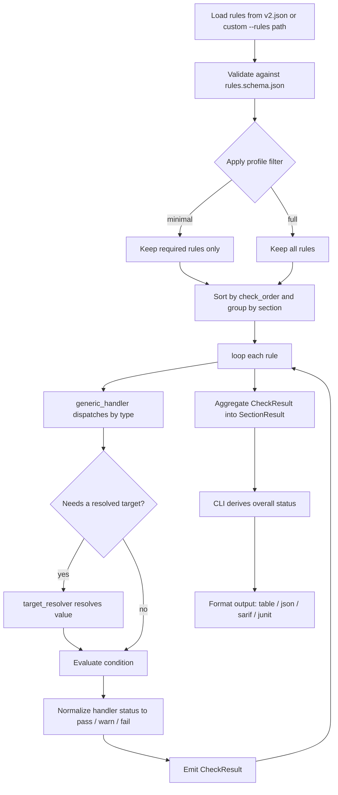

# Diagnostics Reference

> **Localization:** This is a canonical, English-only reference document
> (partly generated from the rule set). It is intentionally outside the
> translated README set (`README.ko.md`, `README.ja.md`, `README.zh-CN.md`)
> and requires no translation updates when diagnostics change.

Azure Functions Doctor ships with a built-in diagnostics set for the **Azure Functions Python v2 programming model**.

Diagnostics are grouped by section, then evaluated as required or optional checks.
Required checks protect baseline correctness (runtime, project structure, and core dependencies),
while optional checks provide operational guidance (tooling, telemetry, and hygiene).

## Programming Model Detection

Before running rule handlers, Doctor classifies the repository into one of four programming-model states:

| State | Meaning | Doctor behavior |
| --- | --- | --- |
| `v2` | v2 signals were found (`function_app.py`, `FunctionApp()` / `Blueprint()`, or trigger decorators). | Continue with the normal v2 ruleset. |
| `unsupported_v1` | Legacy `function.json` files were found without v2 signals. | Return a single failed `programming_model` section explaining that Python v1 is unsupported. |
| `mixed` | Both v1 (`function.json`) and v2 (`FunctionApp` / decorators) signals were found. | Return a single failed `programming_model` section describing the mixed state. |
| `unknown` | No v2 signals and no `function.json` files were found. | Return a single failed `programming_model` section explaining that v2 was not detected. |

For `unsupported_v1`, `mixed`, and `unknown`, no v1-specific checks run and no other v2 rules execute.

## How Diagnostics Are Evaluated

The following pipeline shows how a scan moves from the rule asset to formatted
CLI output. It complements the sequence diagram in
[architecture.md](architecture.md#diagnostic-pipeline) by focusing on per-rule evaluation.



Each rule is executed by a handler and returns a raw handler status (`pass` or `fail`).
The doctor then applies canonical mapping based on whether the rule is required:

| Handler status | `required: true` | `required: false` |
| --- | --- | --- |
| `pass` | `pass` | `pass` |
| `fail` | `fail` | `warn` |

Section status is `fail` if any required check in that section fails.
Optional failures do not fail a section, but they remain visible as warnings.

## Required Checks

These checks run in both `full` and `minimal` profiles.

| Check | Purpose |
| --- | --- |
| Python version | Ensure Python 3.10 or newer. |
| `requirements.txt` | Ensure dependency declarations exist. |
| `azure-functions` package | Ensure the Functions library is declared. |
| `host.json` | Ensure the project includes host configuration. |
| `host.json` version | Ensure host.json declares `"version": "2.0"`. |
| Orchestrator determinism | Ensure orchestrator/entity functions avoid nondeterministic APIs. |

### Required Check Details

| Label | Rule ID | Handler Type | Fails When |
| --- | --- | --- | --- |
| Python version | `check_python_version` | `compare_version` | Current interpreter is lower than `3.10`. |
| `requirements.txt` | `check_requirements_txt` | `dependency_manifest` | No dependency manifest found (`requirements.txt` or `pyproject.toml` dependency declarations). |
| `azure-functions` package | `check_azure_functions_library` | `package_declared` | `azure-functions` is not declared in `requirements.txt` or `pyproject.toml`. |
| `host.json` | `check_host_json` | `file_exists` | `host.json` is missing at project root. |
| `host.json` version | `check_host_json_version` | `host_json_version` | `host.json` does not declare `"version": "2.0"`. |
| Orchestrator determinism | `check_durable_nondeterminism` | `durable_nondeterminism` | An orchestration/entity function calls a nondeterministic API (`datetime.now`, `random`, `uuid`, `requests`, `open`, `os.getenv`). |

## Optional Checks

These checks run only after the repository has been classified as a supported `v2` project.

| Check | Purpose |
| --- | --- |
| Programming model v2 | Detect decorator-based Azure Functions usage (heuristic). |
| Blueprint registration | Warn when decorated Blueprints are declared but never registered on the FunctionApp. |
| Virtual environment | Confirm local development is isolated. |
| Python executable | Confirm Python is available and resolvable. |
| azure-functions-worker not pinned | Warn if azure-functions-worker is declared in requirements.txt. |
| `local.settings.json` | Flag missing local settings for development. |
| Azure Functions Core Tools | Recommend local tooling presence. |
| Core Tools version | Recommend Functions Core Tools v4+. |
| Durable Functions configuration | Validate `durableTask` when durable usage is detected. |
| Application Insights configuration | Detect telemetry configuration signals. |
| `extensionBundle` | Check host extension bundle configuration. |
| ASGI/WSGI compatibility | Detect framework callable exposure. |
| Unwanted files | Flag common junk files in project trees. |

### Optional Check Details

| Label | Rule ID | Handler Type | Warns When |
| --- | --- | --- | --- |
| Programming model v2 | `check_programming_model_v2` | `source_code_contains` | Project source does not expose `@app.` decorators in AST mode. |
| Blueprint registration | `check_blueprint_registration` | `blueprint_registration` | A `func.Blueprint()` alias is used in decorators but never appears in `register_functions(...)` anywhere in the project. |
| Virtual environment | `check_venv` | `any_of_exists` | None of `VIRTUAL_ENV`, `CONDA_PREFIX`, or `UV_PROJECT_ENVIRONMENT` is set. |
| Python executable | `check_python_executable` | `path_exists` | `sys.executable` is empty or points to a missing path. |
| azure-functions-worker not pinned | `check_azure_functions_worker` | `package_forbidden` | `azure-functions-worker` is declared in `requirements.txt`. |
| `local.settings.json` | `check_local_settings` | `file_exists` | Local settings file is absent for local execution scenarios. |
| Azure Functions Core Tools | `check_func_cli` | `executable_exists` | `func` executable is not available on `PATH`. |
| Core Tools version | `check_func_core_tools_version` | `compare_version` | Detected Core Tools version is lower than `4.0`. |
| Durable Functions configuration | `check_durabletask_config` | `conditional_exists` | Durable usage detected but `$.extensions.durableTask` is missing. |
| Application Insights configuration | `check_app_insights` | `any_of_exists` | No telemetry signal found in env vars or `host.json`. |
| `extensionBundle` | `check_extension_bundle` | `host_json_property` | `$.extensionBundle` key is not present in `host.json`. |
| ASGI/WSGI compatibility | `check_asgi_wsgi_exposure` | `callable_detection` | No ASGI/WSGI app exposure patterns are detected. |
| Unwanted files | `check_unused_files` | `file_glob_check` | Common deploy-time junk patterns are found. |
| Decorator order | `check_decorator_order` | `decorator_order` | A handler stacks `@validate_http` outside (above) `@with_context`, so validation/OpenAPI metadata is discarded. |
| Endpoint metadata coverage | `check_endpoint_metadata` | `endpoint_metadata` | The project depends on `azure-functions-validation` but an HTTP route handler lacks `@validate_http`, so it emits no endpoint OpenAPI metadata. |
## Status Mapping

- `pass`: check succeeded
- `warn`: optional check failed
- `fail`: required check failed

## Pass, Warn, and Fail Examples

```python
from azure_functions_doctor.api import run_diagnostics


def split_by_status(path: str) -> dict[str, list[str]]:
    grouped: dict[str, list[str]] = {"pass": [], "warn": [], "fail": []}
    sections = run_diagnostics(path=path, profile="full", rules_path=None)

    for section in sections:
        for item in section["items"]:
            grouped[item["status"]].append(item["label"])

    return grouped
```

```python
from azure_functions_doctor.api import run_diagnostics


def required_failures(path: str) -> list[tuple[str, str]]:
    failures: list[tuple[str, str]] = []
    for section in run_diagnostics(path=path, profile="full", rules_path=None):
        for item in section["items"]:
            if item["status"] == "fail":
                failures.append((section["category"], item["label"]))
    return failures
```

## How Checks Are Loaded from `v2.json`

The default rule source is `src/azure_functions_doctor/assets/rules/v2.json`.
At runtime:

1. `Doctor.load_rules()` reads either custom `rules_path` or built-in `v2.json`.
2. Rules are validated against `src/azure_functions_doctor/schemas/rules.schema.json`.
3. Rules are sorted by `check_order`.
4. Rules are grouped by `section` during execution.
5. Handler results are normalized to `pass` / `warn` / `fail`.

The following snippet shows how built-in rules can be loaded directly for inspection.

```python
import importlib.resources
import json


def load_builtin_v2_rules() -> list[dict]:
    assets = importlib.resources.files("azure_functions_doctor.assets")
    rules_path = assets.joinpath("rules/v2.json")
    with rules_path.open(encoding="utf-8") as handle:
        return json.load(handle)
```

## Profile Behavior

- `full`: runs required and optional checks
- `minimal`: runs only required checks (`required: true`)

Choose `minimal` for strict CI gating on baseline correctness, and `full` for local quality feedback.
